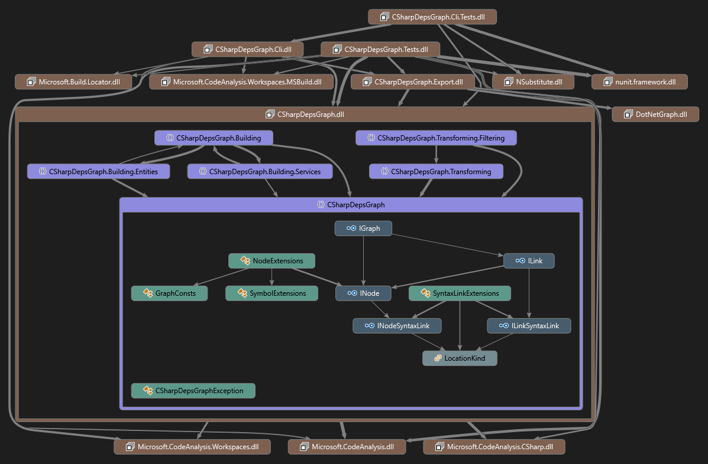
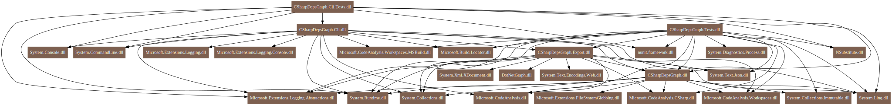

# CSharpDepsGraph(csdg)

CSharpDepsGraph(`csdg`) is a command-line tool for visualizing dependencies in C# projects. It analyzes all dependencies in a solution using Roslyn, builds a complete dependency graph, and then exports it to the desired format.

#### Supported output formats
- Json: Creates a graph dump in json format.
- [Dgml](https://wikipedia.org/wiki/DGML): Creates a file that can be opened in the visual studio. To view it you need to install the corresponding [component](https://stackoverflow.com/a/62656606/3907965).

- [Graphviz](https://wikipedia.org/wiki/Graphviz): Creates a dot file that can be viewed through any graphviz viewer. For this format support only one level export


## Installation

#### As global tool
```bash
dotnet tool install --global CSharpDepsGraph.Cli
```

#### From source

```bash
# Clone repo
git clone https://github.com/Vasek-gh/CSharpDepsGraph.git
cd CSharpDepsGraph

# Build solution. After this you can find binary in src/CSharpDepsGraph.Cli/bin/Release/net8.0
dotnet build -c Release

# Optionaly you can run tests
dotnet build tests/CSharpDepsGraph.Tests/TestData/TestProject.sln -p:WarningLevel=0
dotnet test -c Release --no-restore --no-build
```


## Usage

> CSharpDepsGraph uses the Microsoft.CodeAnalysis package for code analysis. Microsoft.CodeAnalysis does not build or restore projects. Therefore, before using CSharpDepsGraph on any project, this project must first be built.

> All examples use the command name csdg. However, if you're using the compiled binary yourself, you'll need to use CSharpDepsGraph.Cli.

### Basic usage

Tool has built-in help, which should be enough to understand how to use it. To show help, type:
```bash
csdg -h
```
Help is also available for each command:
```bash
csdg json -h
```
An example of how you can get a complete graph in dgml format:
```bash
csdg dgml CSharpDepsGraph.slnx
```
Or the same thing in json format:
```bash
csdg json CSharpDepsGraph.slnx
```

### Cli options

#### Common options

- ```--verson```<br>Show version information
- ```-?|-h|--help```<br>Show help and usage information
- ```-v|--verbosity <level>```<br>Sets the verbosity level of the command. Allowed values are: ```q[uiet]```, ```m[inimal]```, ```n[ormal]```, ```d[etailed]```, ```diag[nostic]```. Default : ```normal```
- ```-p|--property <name=value>```<br>Defines one or more MSBuild properties. Specify multiple properties delimited by semicolons or by repeating the option: ```-p prop1=val1;prop2=val2``` or ```-p prop1=val1 -p prop2=val2```.
- ```-o|--output <output>```<br>The file name where the export should be written.
- ```--parse-generated```<br>By default, files marked as generated are excluded from parsing. This is done to reduce useless references within the generated code. However, if you enable this option, generated files located outside the intermediate output path will be parsed completely.
- ```--links-to-self```<br>By default, all dependencies within a class (for example, a relationship to a private field) are ignored. If you enable this option, all dependencies will be included.
- ```--split-asm-versions```<br>By default, when building a graph, all versions of a single assembly will be merged into a single node. This means that if your project uses multiple target frameworks, you'll only end up with a single node per System.dll (or other assemblies). This option forces a separate node to be generated for each assembly version, and dependencies will also be created for that specific version.
- ```--hide-external```<br>If you enable this option, all nodes that point to external assemblies will be excluded.
- ```--node-filter <filter action,glob pattern>```<br>Defines one or more node filter. Glob pattern is applied on the node path. The filter action can be ```hide```, ```dissolve``` or ```skip```. When a node is hidden, it is deleted along with all its connections. When a node dissolves, the node is hidden and its links are linked to its parent. When a node is skipped, the node remains as is. All filters are applied to the node one by one. When the filter is triggered, this chain is interrupted.

#### Dgml specific options

- ```--export-level <level>```<br>Defines the level below which all nodes are excluded. Allowed values are: ```assembly```, ```namespace```, ```type```, ```public-member```, ```all```. Default: ```all```.

#### Graphviz specific options

- ```--export-level <level>```<br>Defines the level of nodes to export. Allowed values are: ```assembly```,```namespace```. Default: ```assembly```

#### Json specific options

- ```--format```<br>When enabled json writes formatted output.
- ```--exclude-locations```<br>When enabled, export do not write locations.
- ```--inline-paths```<br>When this option is enabled, the path to the file is written directly to the location.itself.

### Examples
Export to specific file
```bash
csdg dgml CSharpDepsGraph.slnx -o sample.dgml
```
Export to graphviz namespace level
```bash
csdg graphviz CSharpDepsGraph.slnx --export-level namespace
```
Export to dgml wtih filter all System and Microsoft.Extensions assemblies
```bash
csdg dgml CSharpDepsGraph.slnx --node-filter hide,**/System.* --node-filter hide,**/Microsoft.Extensions.*
```

## Limitations
- Currently msbuild finds by ```MSBuildLocator.RegisterDefaults()```
- Only **dgml** and **json** can export full hierarchy. Others will be export one level always
- When creating a graph for a namespace, no links are ever created. For example, for the expression ```System.Threading.Thread.CurrentThread```, only links to ```Thread``` and ```CurrentThread``` will be created.